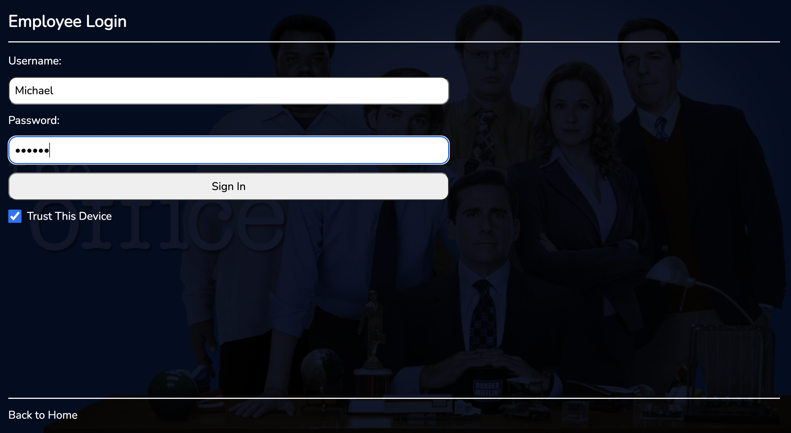
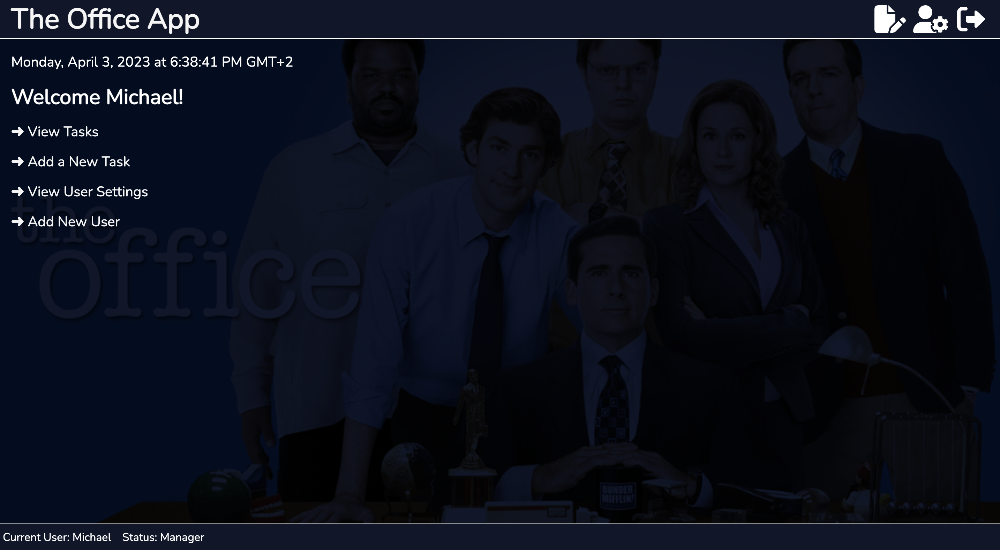
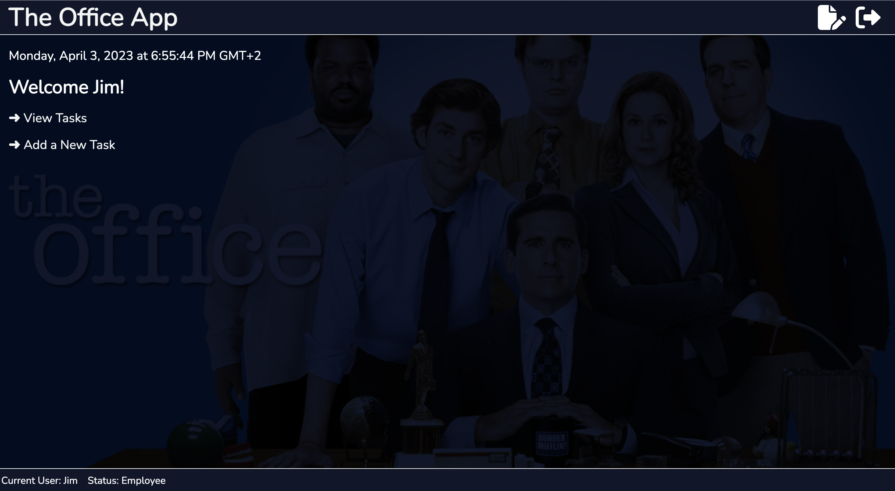
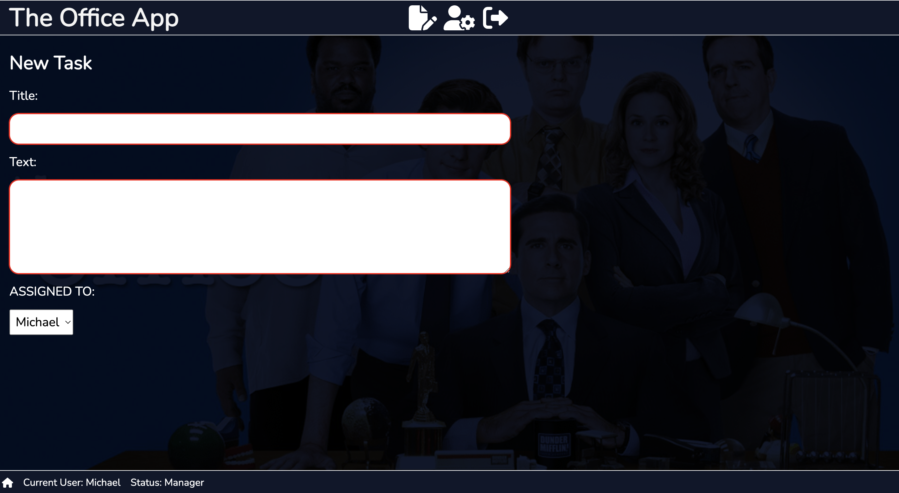
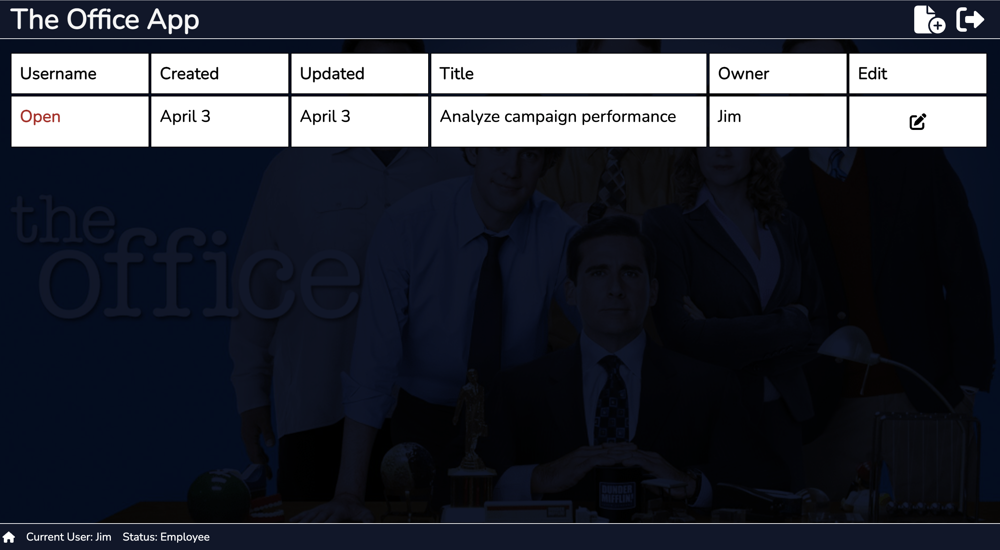
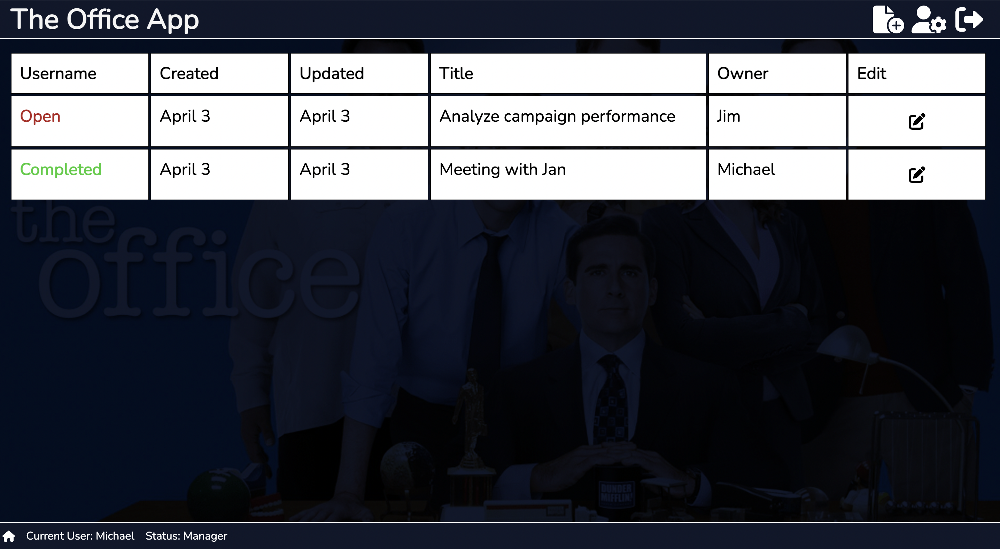
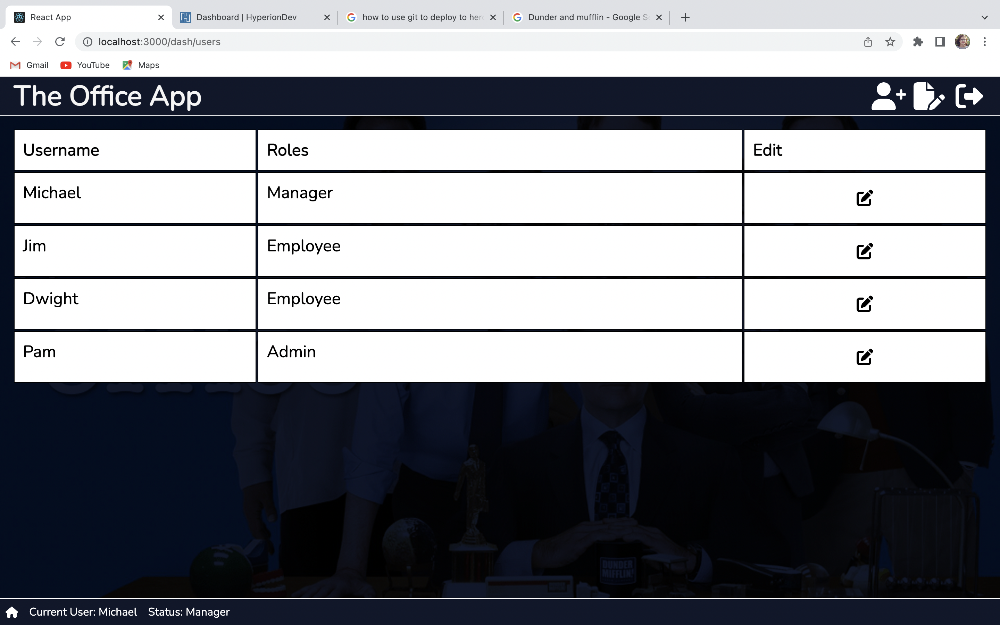
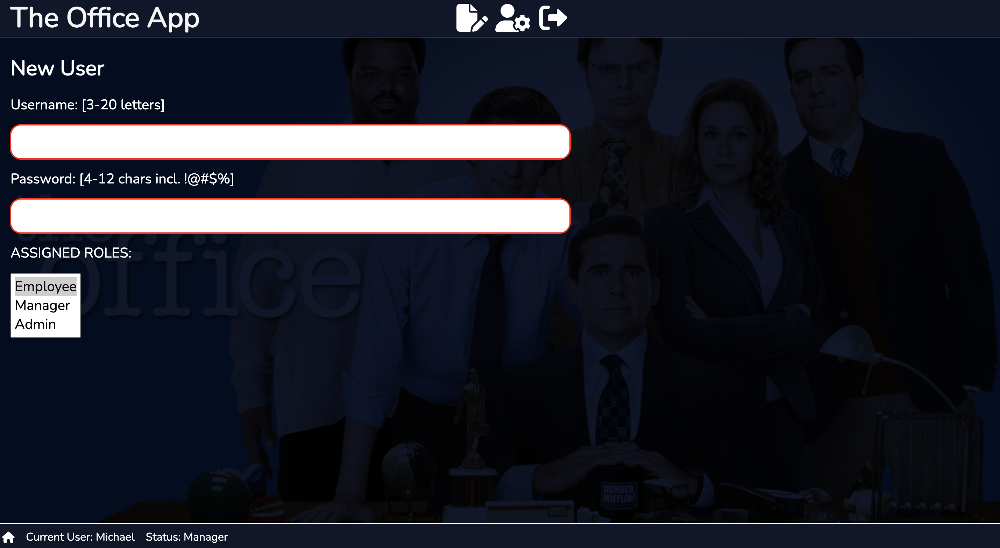

# The Office App!

## Description

This app is a Task Management system for a small group of employees that work at Dunder and Mifflin Paper Company, Scranton. If you have watched the show 'The Office', you will be familiar with the employee names listend in this app. The manager, Michael Scott, assigns tasks to employees, authenticates and saves tasks on MongoDB. Sometimes, well most of the time, he needs his secretary Pam to help him work this app, therefore she has admin rights. The app will also include features that will only be available to the manager and admin users (Michael and Pam) that make it easier to manage tasks, clients and employees with a simple ui and easy navigation to increase workflow. Each employee will be able to login and create tasks or view tasks assigned to them by the admin or manager. The employee is able to view and edit his tasks, but not view or edit other employee's tasks. Only manager and admin users can delete tasks.

Deployed project - [Live Link to the project]()

## Table of Contents

- [Technologies](#technologies)
- [Instructions](#how-to-use)
- [System Architecture](#system-architecture)
- [System Requirements Specification](#system-requirements-specification)
- [Deployment](#deployment)

## Technologies

- Javascript
- React
- CSS
- Node
- Express
- JSON Web Token
- MongoDB

---

## How To Use

#### Installation

Clone or download this repository.

To install the backend of the project cd into the project directory and run 'npm install'. Then 'npm start' to run the server and it will start on port [http://localhost:3500].

To install the frontend of the project cd into the frontend folder and run 'npm install'. Then 'npm start' to run the project and the app will open on port [http://localhost:3000].

To modify MongoDB URIs, go into the .env file and add your own database. You can also generate your own JWT access token secret through node prompt. e.g. require('crypto').randomBytes(64).toString('hex'). 

### Step 1

When the application loads the user will be directed to the landing page which welcomes the user. The user must click on the Employee login in the bottom left hand corner of the footer. 

### Step 2

To have access to the application an employee needs to have an account but only admin and manger users can create an account for each employee. Always check trust this device on login page to stay logged in if the app refreshes. For the purpose of this demonstration to login use the credentials below:

> username: Michael
> password:123456

The password is the same for employees: Dwight, Jim and Pam. 

### Step 3

Once successfully authenticated you will be redirected to the dashboard which looks different based on user roles assigned by admin or manager users. 

### Step 4

To create a new task either click on tasks icon in the navigation or click on add new task under welcome message. The save button is disabled until all fields are completed. To go back to the user's Home either click the Home icon in the footer or 'The Office App' logo in the header. 

### Step 5

To view task click view task under welcome message or click task icon if a user is logged in as an employee they will only see notes assigned to their account and they can update task to open or completed. If a user is logged in as admin/manager they will see all tasks assigned to each employee and only admin and mangers have complete crud functionalities on these notes.

### Step 6

View users is only available for admin/managers, click view user settings click /user icon in navigation bar.

### Step 7

Add new user is only available for admin/manager users click add new user or new user icon in navigation,save button is disabled until all fields are completed. 

## System Architecture

The frontend will be built using the "Create react app" starter kit. Using React I'll also be taking advantage of react libraries like Redux, Redux Toolkit for state management, React Router Dom for routing and JWT decode.

The backend will be built using Nodejs and Expressjs. This app will use MongoDB as a database, which is a huge advantage for performance, as there is no need for downtime when upgrading or scaling the database up. 

### Security

1. All users will be registered by either the admin or manager. Authentication will be handled with JSON Web Tokens (JWT) and password stored in the database will be hashed using bcrypt.

2. The Express application also users cors with a list of allowed origins to control access to the api.

### Reliability

1. Error messages will be clear and helpful, rather than confusing messages.

2. As stated above, validation will reduce issues due to users entering blank form fields or accidentally deleting articles.

3. App will use MongoDB for the database. This eliminates the need to be worried about backing up tasks, since that is all handled by MongoDB.

4. Mongo also allows for upgrades/updates to the database with no downtime to the website.

---

## system requirements specification

### User Stories

1. Replace current sticky note system
2. Add a public facing page with basic contact info
3. Add an employee login to the notes app
4. Provide a welcome page after login
5. Provide easy navigation
6. Display current user and assigned role
7. Provide a logout option
8. Require users to login at least once per week
9. Provide a way to remove employee access asap if needed
10. Notes are assigned to specific employees
11. Notes have a ticket #, title, note body, created & updated dates
12. Notes are either OPEN or COMPLETED
13. Users can be Employees, Managers, or Admins
14. Notes can only be deleted by Managers or Admins
15. Anyone can create a note (when customer checks-in)
16. Employees can only view and edit their assigned notes
17. Managers and Admins can view, edit, and delete all notes
18. Only Managers and Admins can access User Settings
19. Only Managers and Admins can create new users
20. Desktop mode is most important but should be available in mobile

---

### Functional Requirements

1. A user will only need a username and password to create an account
2. The software shall have a dashboard that lists all the tasks.
3. When a user clicks add task on the home page a form will be displayed on the screen to capture the tasks details.
4. User clicks on submit button
   to add the task to the database and redirected to the dashboard.
5. When User clicks on update a form will be displayed to make changes or update the progress status of a task.
6. The app shall have a filter for recorded tasks matching the criteria entered by the user and display results.
   7.Only admin and managers can add new users
   8.Only admin and managers can delete tasks

---

### Non-functional Requirements

1. The application shall be secure from hackers.

2. The application shall have a database that stores all the data requirements of the application.

3. The application shall be backed up and and able to be restored.

4. The shall be responsive for mobile usage.

5.The application shall be compatible with chrome and firefox browsers.

---

## Deployment

The app will be deployed on render.com. [https://render.com/]. Render is a free and easy to use for static and web service applications, that can be automatically deployed through a github repository. This was perfect if I needed to make changes to my code and then I just had to push the changes through git to github - and then it would automatically connect and update to my render.com website. It is so effortless! Another reason for choosing render was because I could changed the environment variables in the backend. Environment vairables are used to store API keys and other configuration values and secrets. I stored my database URI, node version, and JWT access token & refresh token secret.

---

## Deployed app

- You can view the deployed app at https://officeapp2.onrender.com/
